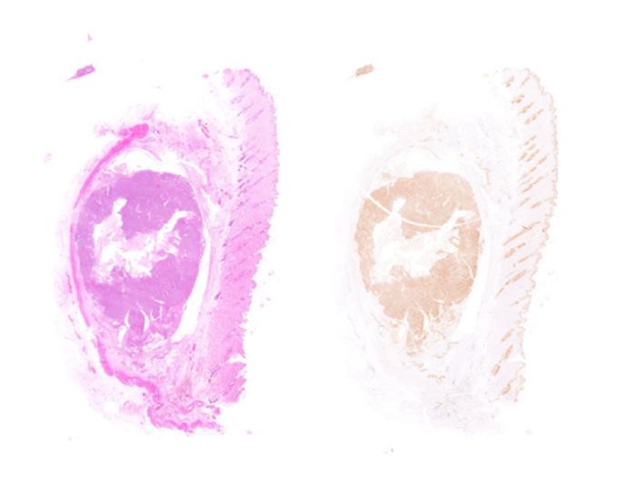

# Volume corrected mitotic index (M/V-index) on hematoxylin and eosin images
This repository contains the associated programming code for the bachelor thesis "Volumenbasierte Berechnung der Mitoseaktivität von Mammakarzinomen mit Hilfe neuronaler Netze auf Hämatoxylin-Eosin-Bildern". First, the relevant epithelial tissue was segmented on the basis of H&E whole slide images (WSIs). Secondly, the mitoses were determined on the H&E WSI with the help of a mitosis detector and the M/V-index was calculated in the area with the highest mitotic activity. 

## Explorative Results 
A total of 50 tissue sections from dogs with confirmed breast carcinoma were available as a data set. These were stained with H&E staining and cytokeratin staining. In total, 100 WSIs were available. 

<p align="center">
  
</p>

In order to automatically generate segmentation masks for the training of the neural network based on the cytokeratin staining, various methods such as colour deconvolution, thresholding, and morphological filters were applied. The individual predicted 512x512 pixel patches of the model were merged into a whole WSI. Using the H&E WSI, the predicted WSI and a mitosis detector, the M/V-index was calculated. 

## Modelling Results

The U-Net architecture was chosen for the segmentation model. Here, an intersection over union (iou) was calculated on the individual 512x512 pixel patches during training. 
<p align="center">
  
</p>
In addition, an entire Slide-IoU was calculated on the subsequently created inference WSIs, in which the entire cytokeratin WSI was used as ground truth. 
<p align="center">
  
</p>
This resulted in a median iou of 45% on the individual patches in training. The intersection over union on the entire WSI of the inference slides resulted in an median of 48%.

## Usage

In order to calculate the M/V-index of H&E WSIs, the epithelial tissue must first be segmented. The inference script [create_patch2slide.py] is used for this. 

The list of parameters is as follows: 
* `source`: path to the H&E-WSI to be processed
* `overlap`: patch overlap when reading from the H&E-WSI (default: 256)
* `patch_size`: size of the patches (default: 512)
* `level`: downsample level at which to segment the WSI (default: 0)
* `threshold`: model threshold for segmentation of the tissue (default: 0.5)
* `save_dir`: directory to save the predicted WSI

An example of usage is described as follows: 

```bash
python3 create_patch2slide.py --source DATA_DIRECTORY --save_dir RESULTS_DIRECTORY --patch_size 512
```

In the second step, the M/V-index is calculated. The Jupyter Notebook [calculate_m-v-index.ipynb] is used for this. The script expects the H&E-WSI and the predicted WSI as input. 
The output is the m/v-index. 

